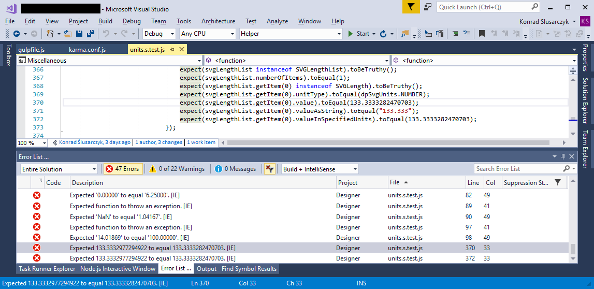

# karma-mvs-reporter
> Logs error and test fails to visual studio Error List window.
> I've started with karma-vserror-reporter by jovdb. The orginal doesn't work for me so I've wrote own error formatting function. 

## How does it look like?

###Error List:

## Installation
First install and configure karma, then install the karma-mvs-reporter

    $ npm install karma-mvs-reporter --save-dev
	> .npm [<ProjectName>] install karma-mvs-reporter --save-dev

## Configuration
configure in `karma.conf.js` the new reporter:

    module.exports = function(config) {
      config.set({
        ...
        reporters: ['mvs'],
		mvsReporter: {
			baseDir: "./" 
		}
        ...
        });
      };
